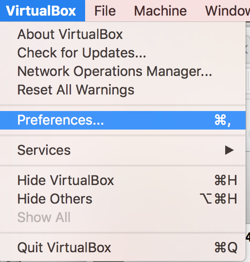
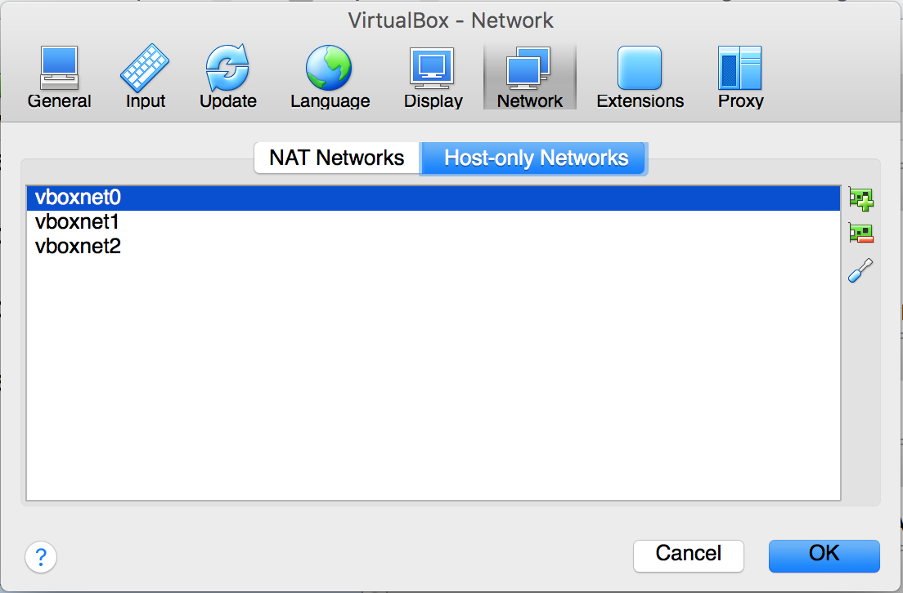
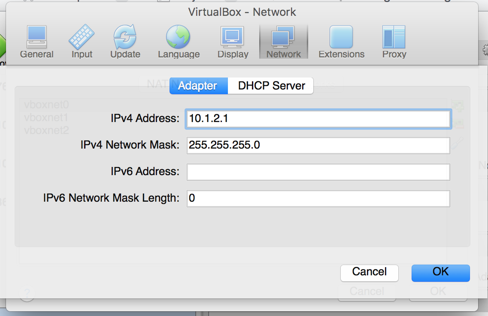
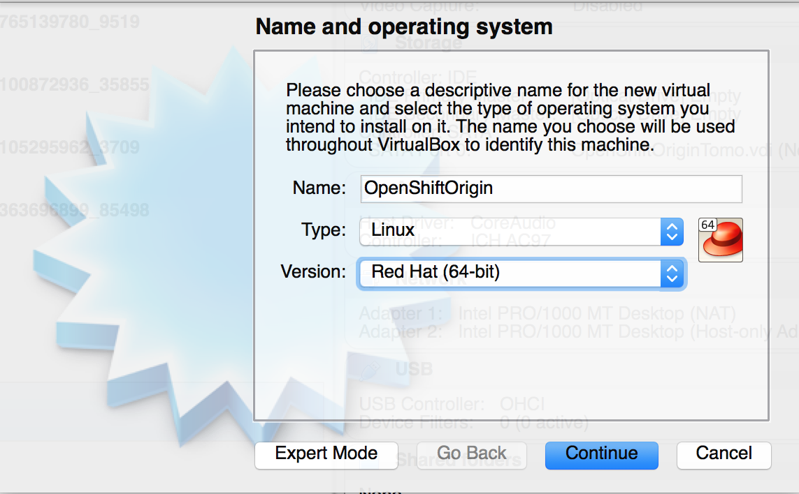
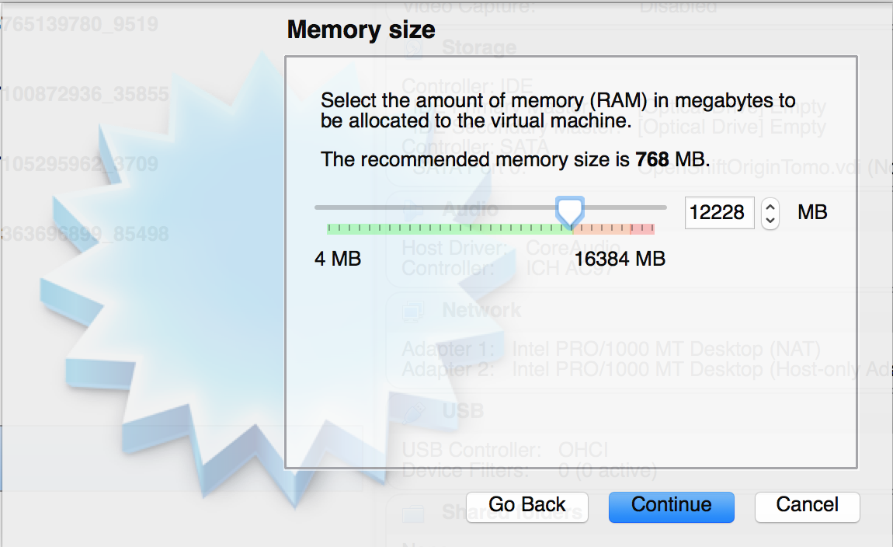
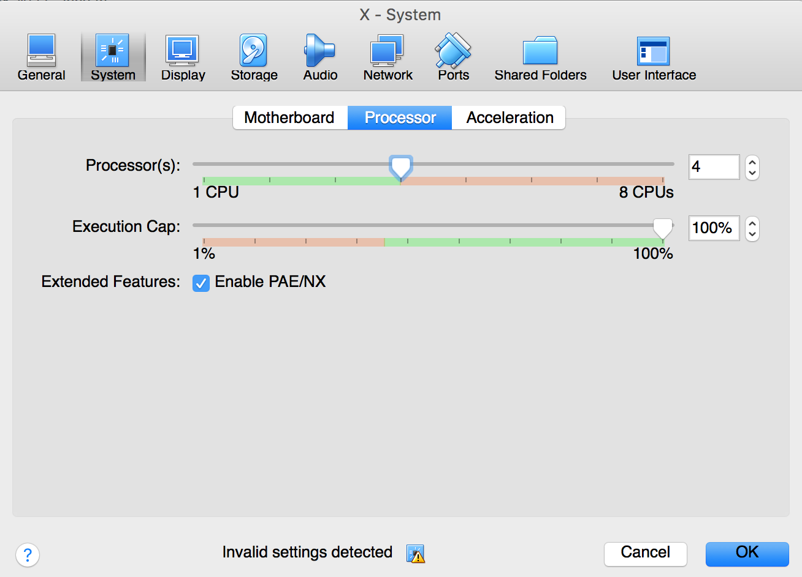
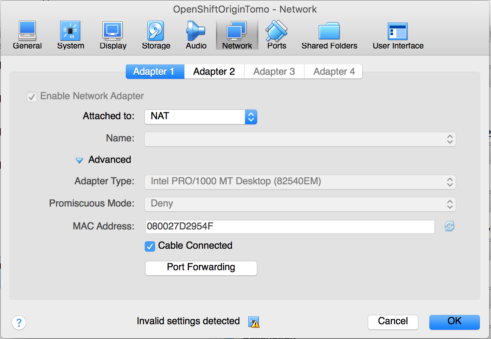
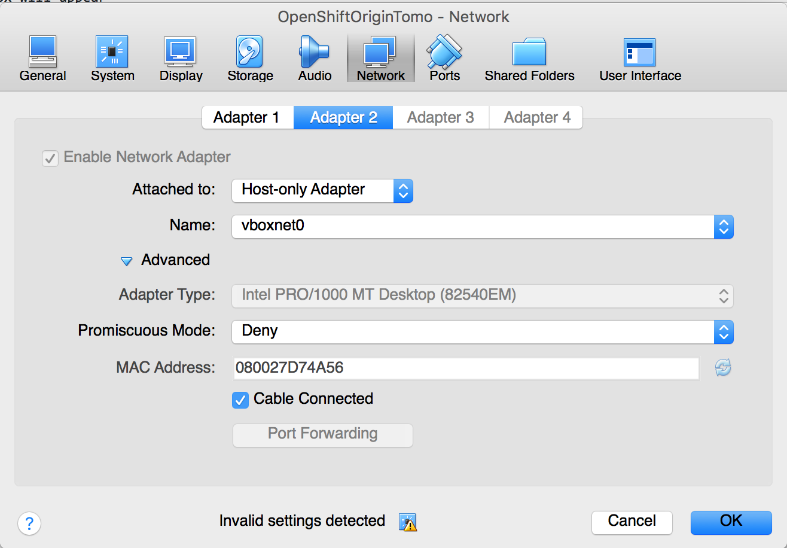

# Install Origin Kubernetes in single node for local Development Environment

## Intentention and Purpose:

* Configure the Developer environment for the project
    1. In order to emulate Production, a DEVTEST to PostDevTest Stage must be in place
    2. CICD must be put into motion so that the Developer can focus on coding rather than configuration
* That the architecture is 3-tier with,
    1. ML9 as the ICD Data/backend. Note: This cannot be deployed into a containerized orchestration platform, in order not to disrupt its inherent HA features.  
    2. Node8 as the Logic/Middleware ICD API fronting the MarkLogic9 Application Server and DB, 
    3. Finally, the client shall be using Angular at the Frontend for RedConnect 

## Assumptions:

- CentOS operating System running as a VM in virtual box.
    >Download CentOS from here: http://isoredirect.centos.org/centos/7/isos/x86_64/CentOS-7-x86_64-Everything-1611.iso
- Create a VM using the centos image, refer to Oracle's docs to do this

## Create a Host-Only Network in VirtualBox
- Navigate to VirtualBox->Preferences

<!--  -->

- A dialog box will appear

<!--  -->

- Add a host-only network and set it's IP address to 10.1.2.1. Note: This can be any legit/valid/no-conflict IP.

<!--  -->
- Click OK
## Install CentOS
- Using VirtualBox, click the Create button

<!--  -->

- specify the name. The version should be Red Hat (64-bit)
- Allocate at least 8 GB RAM, 4 CPU

<!--  -->

<!--  -->

- Configure the Network. Set the first adapter to NAT

<!--  -->

- Set the second adapter to the host-only network you created earlier

<!--  -->

## Configure CentOS

- Once installation is complete, configure the networking inside CentOS. As root edit the file /etc/sysconfig/network-scripts/ifcfg-enp0s3 and set it to these contents

```
[you@host DEV.LOCAL]$ sudo vi /etc/sysconfig/network-scripts/ifcfg-enp0s3 

TYPE=Ethernet
BOOTPROTO=dhcp
DEFROUTE=yes
PEERDNS=yes
PEERROUTES=yes
IPV4_FAILURE_FATAL=no
IPV6INIT=yes
IPV6_AUTOCONF=yes
IPV6_DEFROUTE=yes
IPV6_PEERDNS=yes
IPV6_PEERROUTES=yes
IPV6_FAILURE_FATAL=no
IPV6_ADDR_GEN_MODE=stable-privacy
NAME=enp0s3
DEVICE=enp0s3
ONBOOT=yes
ZONE=public
```
- As root create a file /etc/sysconfig/network-scripts/ifcfg-enp0s8 and set it's contents to the below:

```
[you@host DEV.LOCAL]$ sudo vi /etc/sysconfig/network-scripts/ifcfg-enp0s8

TYPE=Ethernet
BOOTPROTO=none
IPV4_FAILURE_FATAL=no
IPV6INIT=yes
IPV6_AUTOCONF=yes
IPV6_FAILURE_FATAL=no
IPV6_ADDR_GEN_MODE=stable-privacy
NAME=enp0s8
DEVICE=enp0s8
ONBOOT=yes
IPADDR=10.1.2.2
ZONE=public
```
- reboot the virtual machine to make sure the network settings work. After the reboot, test if you can ping yahoo.com:

```
[root@host DEV.LOCAL]#  ping yahoo.com
PING yahoo.com (98.139.180.149) 56(84) bytes of data.
64 bytes from ir1.fp.vip.bf1.yahoo.com (98.139.180.149): icmp_seq=1 ttl=63 time=227 ms
64 bytes from ir1.fp.vip.bf1.yahoo.com (98.139.180.149): icmp_seq=2 ttl=63 time=228 ms
^C
--- yahoo.com ping statistics ---
2 packets transmitted, 2 received, 0% packet loss, time 1001ms
rtt min/avg/max/mdev = 227.997/228.146/228.295/0.149 ms
```
- From the host machine, you should be able to ping the VM ip 10.1.2.2. Otherwise, wait awhile, at the VM's Power button, found at the upper right of the console, make sure that the 'Ethernet(enp0s8)' is connected. 

```
C:\Users\you>ping 10.1.2.2

Pinging 10.1.2.2 with 32 bytes of data:
Reply from 10.1.2.2: bytes=32 time<1ms TTL=64
Reply from 10.1.2.2: bytes=32 time<1ms TTL=64
Reply from 10.1.2.2: bytes=32 time<1ms TTL=64

Ping statistics for 10.1.2.2:
    Packets: Sent = 3, Received = 3, Lost = 0 (0% loss),
Approximate round trip times in milli-seconds:
    Minimum = 0ms, Maximum = 0ms, Average = 0ms
Control-C
^C
C:\Users\you>
```
## Install oc client

```bash
curl -L https://github.com/openshift/origin/releases/download/v1.5.1/openshift-origin-client-tools-v1.5.1-7b451fc-linux-64bit.tar.gz -o oc.tar.gz
tar -xzvf oc.tar.gz 
mv openshift-origin-client-tools-v1.5.1-7b451fc-linux-64bit/oc /usr/local/bin/
```

## Install docker

```
[root@host DEV.LOCAL]# yum install -y docker
```
- Edit the file /etc/sysconfig/docker and add the line 

```
INSECURE_REGISTRY='--insecure-registry 172.30.0.0/16'
```
- Edit the file /etc/docker/daemon.json and add the line 

```
{
 "other-prop": 'blah',
 "insecure-registries" : ["172.30.0.0/16"]
}
```
- restart docker

```
[root@host DEV.LOCAL]# systemctl restart docker
[root@host DEV.LOCAL]# systemctl status docker
[root@host DEV.LOCAL]# docker images
```
## Configure firewall

- Run the command below and get the IP

```
[root@host DEV.LOCAL]# docker network inspect -f "{{range .IPAM.Config }}{{ .Subnet }}{{end}}" bridge

172.17.0.0/16
```

- Use the IP return above for the below commands:

```
firewall-cmd --permanent --new-zone dockerc
firewall-cmd --permanent --zone dockerc --add-source 172.17.0.0/16
firewall-cmd --permanent --zone dockerc --add-port 53/udp
firewall-cmd --permanent --zone dockerc --add-port 8053/udp
firewall-cmd --reload
```
- Run the addtional commands below to open the ports from outside the VM

```
firewall-cmd --permanent --zone public --add-port 8443/tcp
firewall-cmd --permanent --zone public --add-port 80/tcp
firewall-cmd --permanent --zone public --add-port 443/tcp
firewall-cmd --permanent --zone public --add-port 10250/tcp
firewall-cmd --reload
 ```

## Install Origin

- Create directory /var/lib/origin/dev.local.data to hold etcd data.

```
[root@host DEV.LOCAL]# mkdir /var/lib/origin/dev.local.data
```

```
[root@host DEV.LOCAL]# oc cluster up \
--public-hostname=10.1.2.2 --routing-suffix=10.1.2.2.nip.io \
--host-data-dir=/var/lib/origin/dev.local.data \
--metrics=true
```
- You will get an output similar to the below

```
-- Checking OpenShift client ... OK
-- Checking Docker client ... OK
-- Checking Docker version ... OK
-- Checking for existing OpenShift container ... 
   Deleted existing OpenShift container
-- Checking for origin:v1.5.1 image ... OK
-- Checking Docker daemon configuration ... OK
-- Checking for available ports ... OK
-- Checking type of volume mount ... 
   Using nsenter mounter for OpenShift volumes
-- Creating host directories ... OK
-- Finding server IP ... 
   Using 10.0.2.15 as the server IP
-- Starting OpenShift container ... 
   Creating initial OpenShift configuration
   Starting OpenShift using container 'origin'
   Waiting for API server to start listening
   Origin server started
-- Adding default OAuthClient redirect URIs ... OK
-- Installing registry ... OK
-- Installing router ... OK
-- Installing metrics ... OK
-- Importing image streams ... OK
-- Importing templates ... OK
-- Login to server ... OK
-- Creating initial project "myproject" ... OK
-- Removing temporary directory ... OK
-- Checking container networking ... OK
-- Server Information ... 
   Origin server started.
   The server is accessible via web console at:
       https://10.1.2.2:8443

   The metrics service is available at:
       https://metrics-openshift-infra.10.1.2.2.xip.io

   You are logged in as:
       User:     developer
       Password: developer

   To login as administrator:
       oc login -u system:admin
```

- Add admin user to admin role so that all projects will be visible in the web console.

```
[root@host DEV.LOCAL]# oc adm policy add-cluster-role-to-user admin admin
```

- Navigate to the web console at https://10.1.2.2:8443 and login with the credentials

```
username: admin
password: admin
```
You should be able to see this:

![alt text] (resources/images/web_console.png)

# Congratulations! DEV-TEST Local Env is up and running!
## Next Step, Configure the [CICD](using_cicd_pipeline.md)
